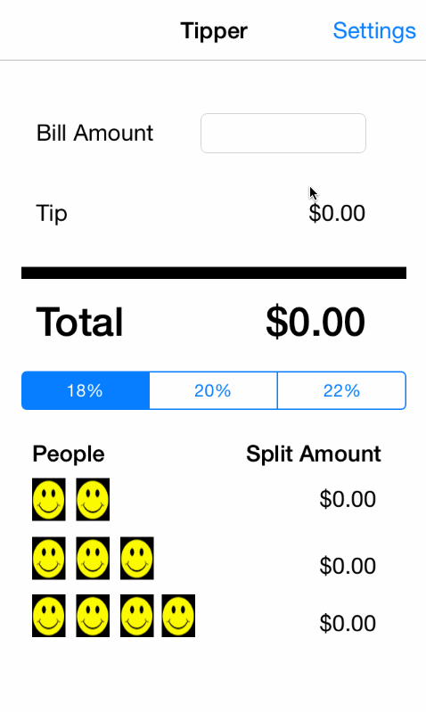

tipper
======

This is a Tips calculator application.  Created as part of the Codepath prework using Swift language.  

4 hours spent to complete assignment

User Stories Completed:

* Requirement: develop tip calculator application with main viewController and Settings ViewController
* Requirement: Allow for Loading and Saving of tip selection from Settings view page. Make use of View Controller lifecycle
* Optional: improve UI with icons and color
* Optional: Add light/dark color theme to settings view.  Update views with the correct theme colors

Notes:  I spent time reviewing notes and watching few tutorial videos.  I hope to improve on this application soon.  

